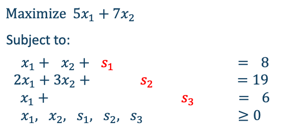
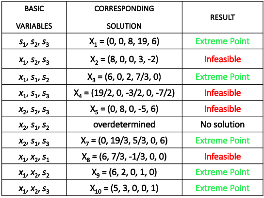
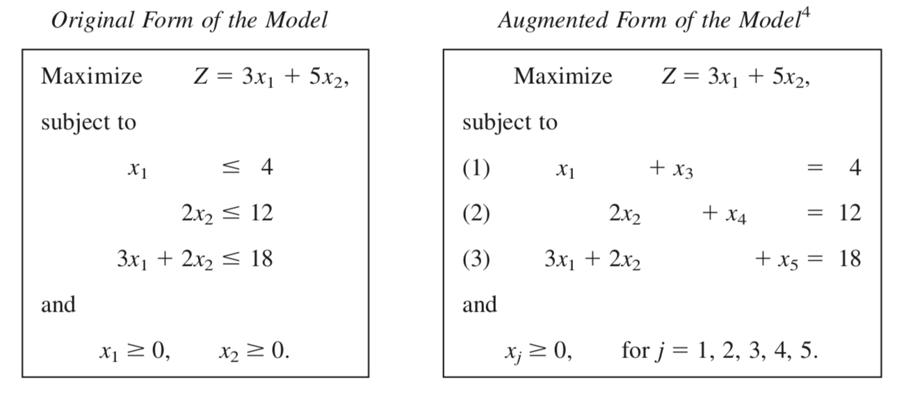
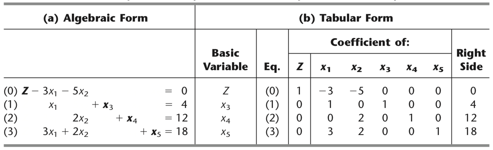
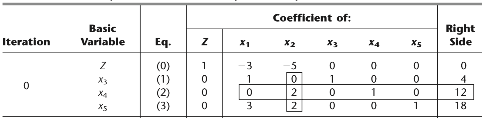
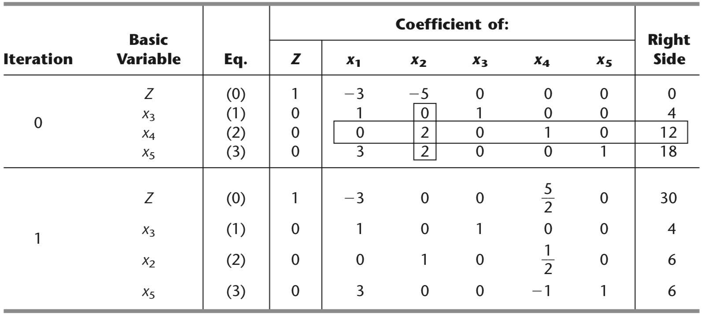
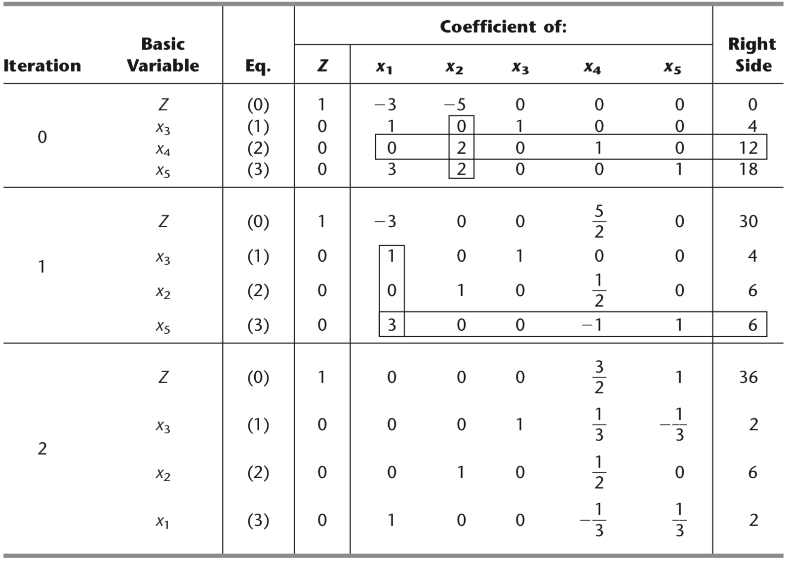

# LP property and definitions
> **Extreme Point Theorem**:
> If an LP has a unique optimal solution, then it is located on one of the extreme points.

For a linear programme a **basic feasible solution** is equivalent to **extreme point**

- A linear program in which all the variables are $\ge$ and all the constraints are $=$ is said to be in **standard form**.
- Standard form is attained by adding **slack variables** to $\le$ constraints, and by subtracting **surplus variables** from $\ge$ constraints.
- Slack and surplus variables have objective function coefficients equal to 0.
- If the LP in standard form has $m$ equations and $n$ variables, then, to find a solution, $n-m$ variables are 0 (**nonbasic**) and $m$ are $\ge0$ (**basic**) 

---
# Example


- There are $m=3$ equations and $n=5$ variables
- If 2 are set to zero, we can find a solution

---

class: inverse, center, middle
background-image: url(assets/ex_graph.png)
background-size: contain

---
# Example cont.
.pull-left[
For 20 variables and 10 constraints, for example, you need to evaluate up to 
$${20\choose 10 } = \frac{20!}{10!10!}=184,756$$
Not efficient to find all the extreme points or the basic feasible solutions. The **Simplex Method** addresses this problem.
]

.pull-right[



]

---
# Simplex Method

.pull-left[
- Developed by George Dantzig in 1947
- Is an algebraic procedure where the underlying concepts are geometric, e.g *going from one vertix to the next one* 
- Based on solving systems of equations
    - Convert inequality constraints to equality (**slack** and **surplus**)
]
.pull-right[

]

1. Start from a (basic) feasible solution (an extreme point of the feasible region)
2. Check whether there exists a better solution among the neighbours of the current solution. If there exists such a solution, then
    1. “Jump” to that solution and go to Step 2
    2. Else STOP. Optimal solution has been found!

---
# Simplex Method: Example
.pull-left[
## Iteration 1

- Find the initial basic solution.

- In this case, it is easy!

- Remind we need to set $(n - m)$ variables in zero, i.e., 2 variables will be set in zero (nonbasic) and 3 will be basic variables.

- General solution of the form $X = (x_1, x_2 , s_1, s_2, s_3)$

$$X_1 = (0, 0, 8, 19, 6) \quad \text{with } z=0$$

]
.pull-right[

]

---
# Simplex Method: Example

- We now ask whether this solution can be improved. 

- Within each iteration of the simplex method, **exactly one** variable goes from nonbasic to basic and **exactly one** variable goes from basic to nonbasic. 

- The variable that goes from nonbasic to basic is called the **entering variable**. It is chosen with the aim of increasing $z$.

- We pick the variable that has the **largest coefficient**.

- The variable that goes from basic to nonbasic is called the **leaving variable**.

- It is chosen to preserve nonnegativity of the current basic variables.

---
# Simplex Method: iteration 2

- Picking the largest coefficient, then $x_2$ will be the entering variable.
- Now, we need to evaluate how much $x_2$ can increase without interfering in the non-negativity of the other variables. 
- Notice that $x_1$ is still nonbasic. Then, to ensure that $s_1,s_2\ge 0$
$$\begin{aligned} s_1 &= 8-x_2 \rightarrow x_2 \le 8\\ s_2 &=19-3x_2 \rightarrow x_2\le 19/3  \end{aligned}$$
- Then, $x_2 = 19/3$ and we need to update the remaining variables (one becomes basic and one must become nonbasic). $s_1= 5/3$ and $s_2 = 0$.

$$X_2 = (0, 19/3, 5/3, 0, 6) \quad \text{with } z=44.33$$
- Rewrite the equations
$$\begin{aligned} z &=5x_1 + 7x_2 = 133/3 +x_1/3-7s_2/3\\s_1 &= 8-x_1-x_2 = 5/3-x_1/3+s_2/3\\ x_2 &=19/3 -2x_1/3-s_2/3\\s_3 &= 6 -x_1\end{aligned}$$

---
# Simplex Method: iteration 3

- The only positive coefficient now is associated to $x_1$.
- We need to evaluate how much $x_1$ can increase without interfering in the non-negativity of the other variables. 
$$\begin{aligned}s_1 &=  5/3-x_1/3\ge 0 \rightarrow x_1 \le 5\\ x_2 &=19/3 -2x_1/3\ge 0 \rightarrow x_1 \le 19/2\\s_3 &= 6 -x_1\ge 0 \rightarrow x_1\le 6\end{aligned}$$
- Then, $x_1 = 5$ and we need to update the remaining variables. $s_1=0$, $x_2 = 3$ and $s_3 = 1$
$$X_3 = (5, 3, 0, 0, 1) \quad \text{with } z=46$$
- Rewrite the equations
$$\begin{aligned} z &= 133/3 +x_1/3-7s_2/3=46-s_1-2s_2\\x_1 &= 5- 3s_1+ s_2\\ x_2 &=19/3 -2x_1/3-s_2/3= 3+2s_1-s_2\\s_3 &= 6 -x_1=1+3s_1-s_2\end{aligned}$$
**This solution cannot be improved! Optimal**

---
## Simplex Method in Tabular form  

- Is a useful way to manually solve an LP, let's see an example
    


**Obs**: from *Introduction to Operations Research, 10th Ed., Hillier & Lieberman*

---
## Simplex Method in Tabular form   



---
## Summary of method

1. **Initialization**: slack variables + decision variables nonbasic
2. **Optimality test**: if all coefficients in Eq. (0) are nonnegative, otherwise
3. **Iteration**: 
    - Step 1: Determine the *entering basic* variable (the "most negative" coefficient) in Eq. (0). Enclose the colum below this coefficient ("pivot column")
    - Step 2: Determine the *leaving basic* variable (min. ratio test)
        - Pick each coefficient in the pivot column that is $>0$
        - Divide each right side by these coefficients
        - Identify the row with the smallest ratio
        - Replace the leaving basic variable for the entering basic (next simplex tableau)
    - Step 3: Solve for the new system by using elementary row operations

---
## Example
### Iteration 0


---
### Iteration 1


---
### Iteration 2


---
## Problem 1

Consider the following LP

$$\begin{align*}
Max\quad &Z = 3x_1+5x_2+6x_3 \\
s.t&\\
&2x_1+x_2+x_3\le 4 \\
& x_1+2x_2+x_3 \le 4\\
&x_1+x_2+2x_3 \le 4\\
&x_1+x_2+x_3\le 3\\
& x_1,x_2,x_3\ge0\end{align*}$$

1. Work through the Simplex method in tabular form
2. Solve the problem using GAMS and reading the constraints from the file "table_const.csv". Also, write the results into "results.txt"

**Hint** Use the following command
```
Table data(j,i) 
$ondelim
$include table_const.csv
$offdelim
;
```
---
## Problem 2
Consider now

$$\begin{align*}
Max\quad &Z = 3x_1+x_2\\
s.t&\\
&x_1+x_2 \ge 1 \\
& 2x_1+4x_2 \le 10\\
& x_1,x_2\ge0\end{align*}$$

1. Work through the Simplex method in tabular form (watch the first constraint)

### Augmented problem
$$\begin{align*}
Max\quad &Z = 3x_1+x_2-M\bar{x}_5\\
s.t&\\
&x_1+x_2 - x_3 + \bar{x}_5  = 1 \\
& 2x_1+4x_2 + x_4 = 10\\
& x_1,x_2, x_3, \bar{x}_5, x_4 \ge0\end{align*}$$

---
## Solve by two phase Simplex method

1. Solve for $Max \quad Z = -\bar{x}_5$ (obtain a feasible initial solution)
2. Solve for $Max \quad Z = 3x_1+x_2$

---
## Additional resources

- [Data Exchange with Other Applications in GAMS](https://www.gams.com/latest/docs/UG_DataExchange.html)
- [Online Simplex Tableau](http://www.phpsimplex.com/simplex/simplex.htm?l=en)
- Simplex method and Tableau form in Chapter 4, Hillier & Lieberman. 