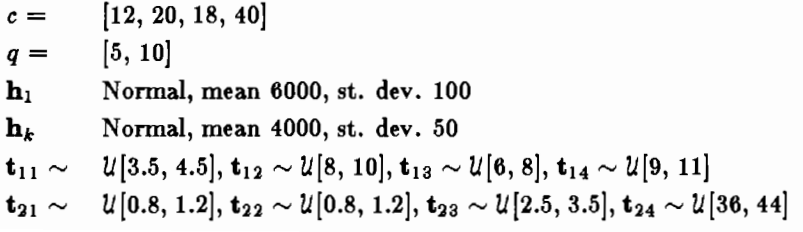

# Stochastic Programming

**Problem**[1](#myfootnote1)

- A furniture shop has 6000 human-hours available in the carpentry shop and 4000 human-hours in the finishing shop per period. All employees are on salary, however, and the actual human-hours available are assumed to be normally distributed random variables wiht deficits resulting from employee absences and surpluses due to voluntary overtime. 
- There are four classes of products each consuming a certain number of human-hours in carpentry and finishing; the actual time consumed is assumed to be uniformly distributed random variable.
- Each product earns a certain profit per item, and the shop has the option to purchase casual labor from outside. 
- Note that the cost of the salaried labor is fixed, and thus does not enter the problem. 

<a name="myfootnote1">1</a>: King, A J, Stochastic Programming Problems: Examples from the Literature.

---
# Data

---
# Formulation

$$\begin{aligned}\max_{x_j} &\sum_{j=1}^4c_jx_j-E\{q_1v_1+q_2v_2\}\\&\text{s.t.}\\&\sum_{j=1}^4t_{kj}x_j \le v_k+h_k\quad k=1,2\\&x_j\ge 0 \quad j = 1,2,3,4\\ &v_k\ge 0 \quad k=1,2   \end{aligned}$$
where 
- $x_j$: amount of product $j$ produced
- $v_k$: hours of casual labor required of type $k$
- $c_j$: profit per unit of product $j$
- $q_k$: cost per hour for casual labor of type $k$
- $t_{kj}$: hours required of type $k$ to produce product $j$
- $h_k$: hours of salaried labor of type $k$ available

---
# Solution

- The GAMS code is in [code](https://github.com/vhmedina/BUST10134/blob/master/wk7/tut_3_1_wk7.gms)

