# Branch-and-Bound[1](#myfootnote1)

- Some business problems can be solved only if variables have integer values.  
- Type of integer programmes

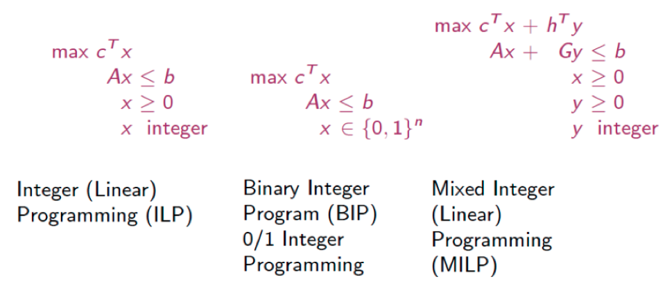

<a name="myfootnote1">1</a>: based on Douglas Alem's lectures.
---
## Solution methods
General algorithms for fall into three main categories:

1. Enumeration Algorithms, which are based on intelligent enumeration of all possible solutions (Branch & Bound). $\rightarrow$ **today's tutorial**
2. Cutting-plane Algorithms, which are derived from the simplex algorithm.
3. Hybrids; e.g., Branch-and-Cut (B&C).

## Branch-and-Bound (B&B)
- B&B is a solution strategy based on the “divide & conquer” principle. 
- The idea is to partition the feasible region of an IP into more manageable subdivisions & then to further partition the subdivisions, if necessary.
- This partitioning process of the solution space is referred to as the branching process.
- In order to avoid unnecessary branching, a bounding scheme is used.
- In general, there are several ways to design both the branching process and the bounding scheme; consequently, there are several B&B algorithms.

---
## Example
ILP
$$\begin{aligned}\max & z = 3x_1 +4x_2\\\text{s.t.}&\\&2x_1+x_2\le 6\\&2x_1+3x_2 \le 9\\&x_1,x_2 \ge 0 \in \mathcal I\end{aligned}$$
ILP relaxation $\text{(LP}_1\text{)}$
$$\begin{aligned}\max & z = 3x_1 +4x_2\\\text{s.t.}&\\&2x_1+x_2\le 6\\&2x_1+3x_2 \le 9\\&x_1,x_2 \ge 0 \end{aligned}$$
- Initialize LB on z to $-\infty$ and UB to 12.75 with $x = (2.25, 1.5)$. Now, we branch on $x_2$ as it is farther from an integer value than $x_1$.
---
## Example

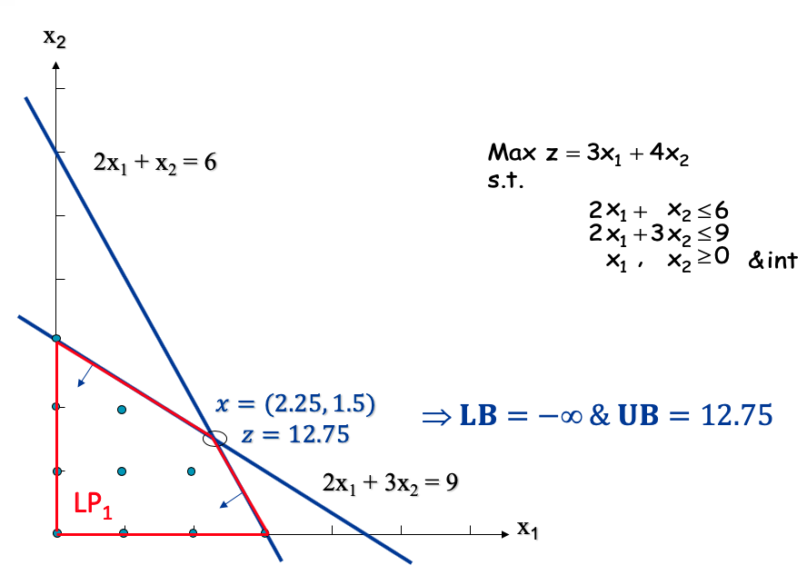

---
## Example

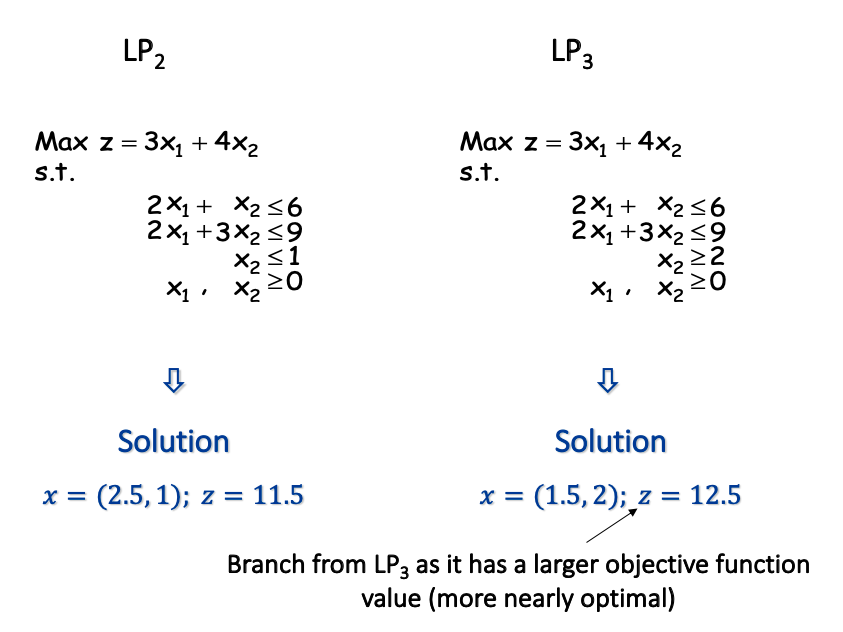

---
## Example

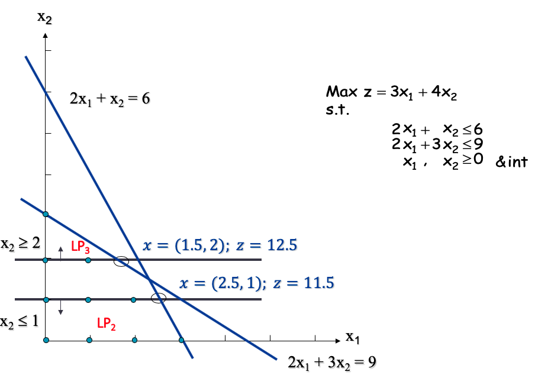
---
## Example

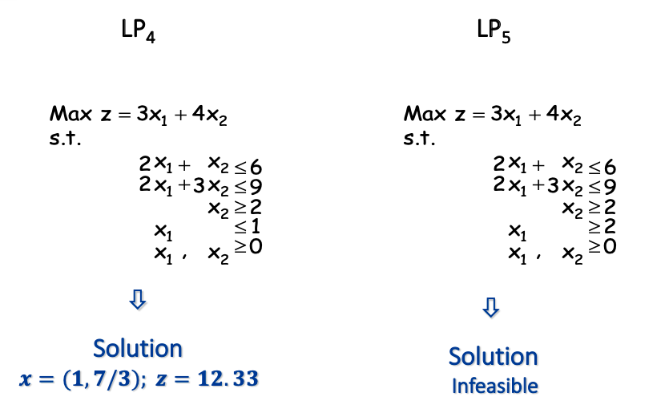
Branching can continue from either $LP_2$ (z = 11.5) or $LP_4$ (z = 12.33). Choose $LP_4$ as it has the largest z-value. 
---
## Example

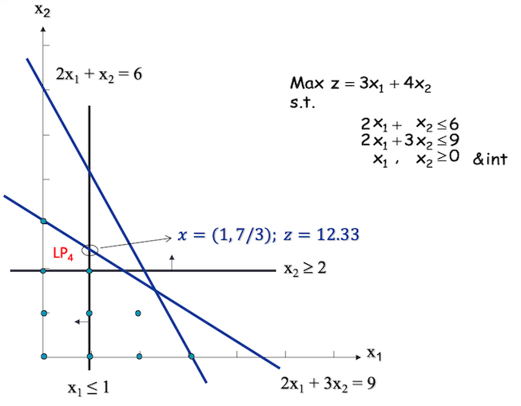
---
## Example
.pull-left[
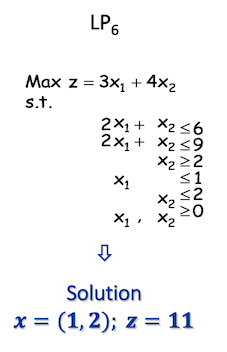
]
.pull-right[
- This is an integral solution and hence becomes a lower bound for the problem (LB = 11) $\rightarrow$ **incumbent solution**.

- Any problem yielding a z-value smaller than LB will be eliminated.
]
---
## Example
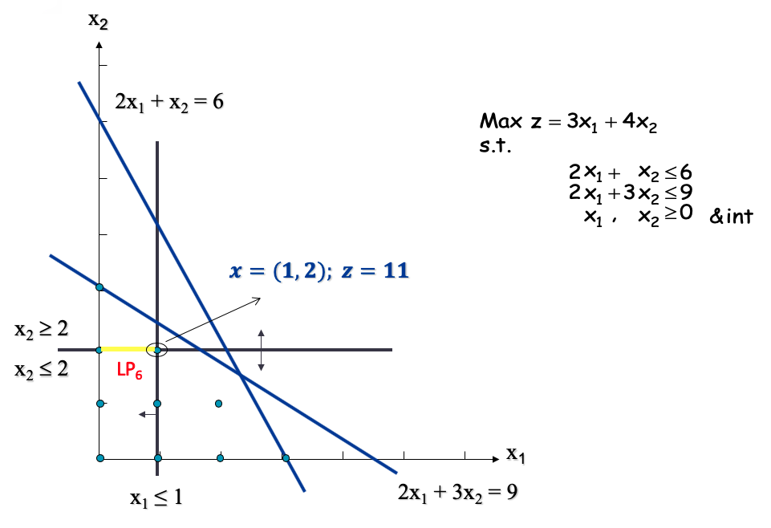
---
## Example
.pull-left[
- This is a better integral solution

- Therefore, the LB is updated to LB = 12

- Any problem yielding a z-value smaller than LB will be eliminated, i.e., $LP_2$ and $LP_6$ are killed!

]
.pull-right[
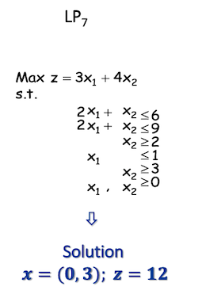
]

---
## Example

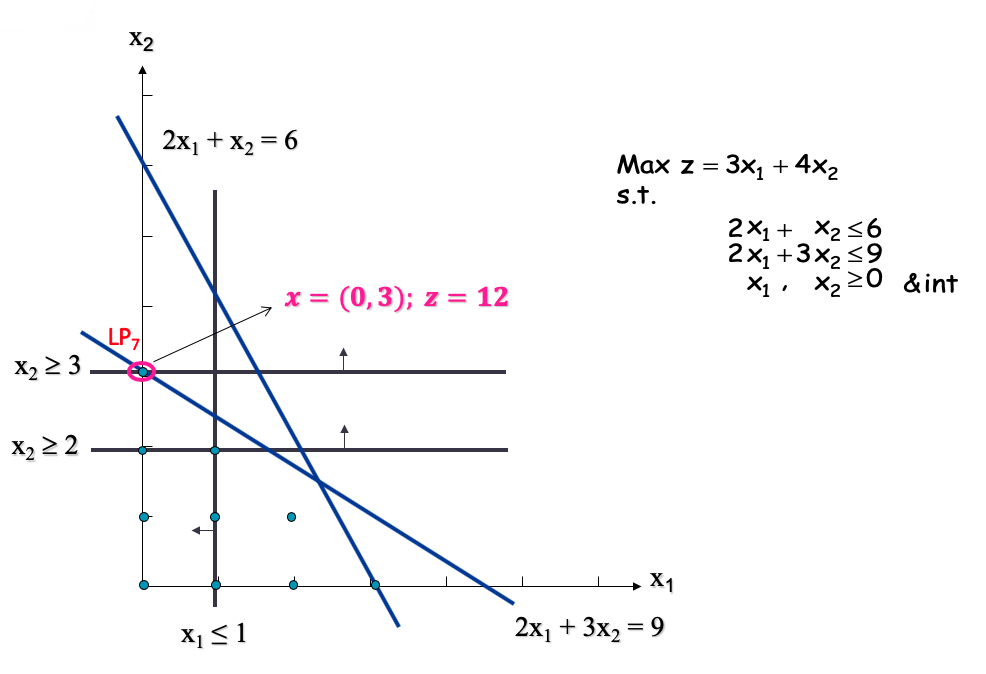

---
## Branch-and-Bound tree

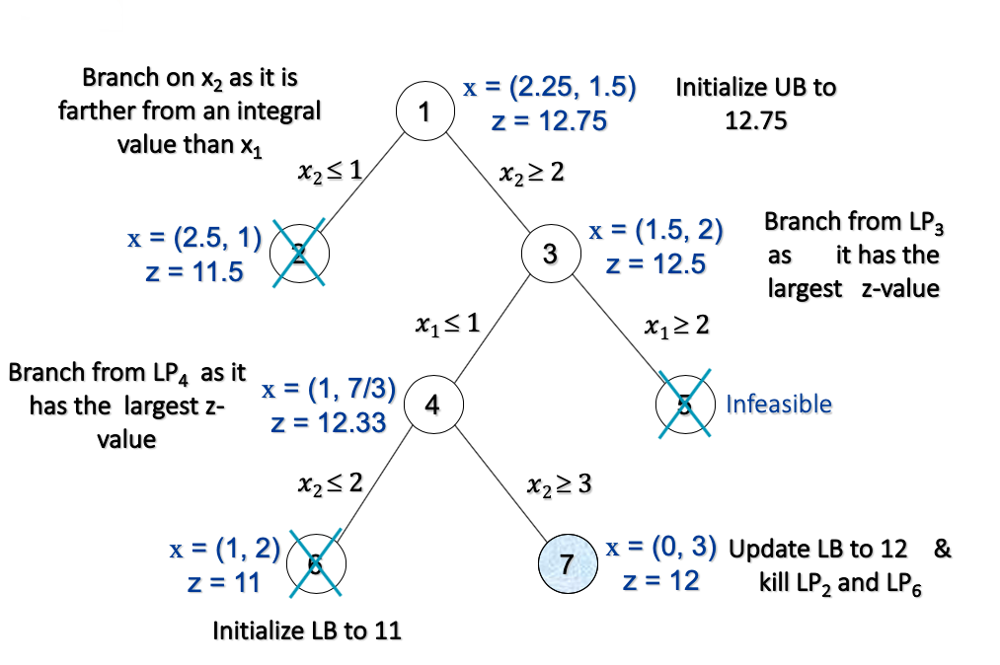
---
# Banch-and-Bound

- When an LP solution contains several fractional integer variables, the decision of which integer variable to branch on next is needed.
- The following rules are commonly used for choosing a branching variable:
  - Variable with fractional value closest to 0.5
  - Variable with highest impact on objective function.
  - Variable with the least index.

- A decision is also needed as to which unpruned node to explore first. In fact, the selection of the branching node strategy could have a substantial impact on a B&B algorithm’s computational requirements
- The most commonly used search strategies include:
  - A **depth-first search strategy** consists of choosing an active node amongst the most recent descendants.
  - A **best-node first strategy** consists of choosing an active node with the best dual bound.
  - In practice, **hybrid strategies** are commonly used; e.g., depth-first until feasible solution is found followed by a mix of best-node first and depth-first.

---
## MIP in GAMS

We know that we could solve each of the LP problems in GAMS with `lp` command

`solve model_name using lp maximizing z;` 

as in the example [here](https://github.com/vhmedina/BUST10134/blob/master/wk9/ex_1_wk9.gms)

Or, by simply introducing `mip` command

`solve model_name using mip maximizing z;`

as in the example [here](https://github.com/vhmedina/BUST10134/blob/master/wk9/ex_2_wk9.gms)
---
## Problem 1
Solve the following MIP problem with B&B algorithm

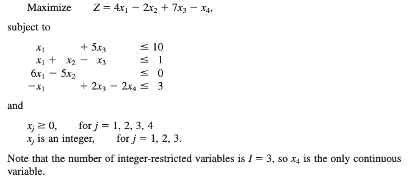

---
## Problem 2
Consider the following IP problem

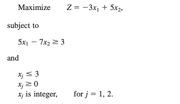
1. Solve this problem graphially
2. Use B&B. For each subproblem, solve its LP relaxation graphically. 
3. Use GAMS to solve it

---
## Problem 3
Consider the following IP problem

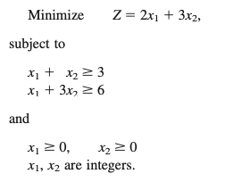
1. Solve this problem graphially
2. Use B&B. For each subproblem, solve its LP relaxation graphically. 
3. Use GAMS to solve it

---
## Solutions

The solutions of the problems are in the [link](https://github.com/vhmedina/BUST10134/blob/master/wk9/sol_wk9.pdf)

Codes for problems 2 and 3 are  [here](https://github.com/vhmedina/BUST10134/blob/master/wk9/tut_4_1_wk9.gms) and [here](https://github.com/vhmedina/BUST10134/blob/master/wk9/tut_4_2_wk9.gms), respectively.

&nbsp;

*Take care and protect the vulnerable!*
